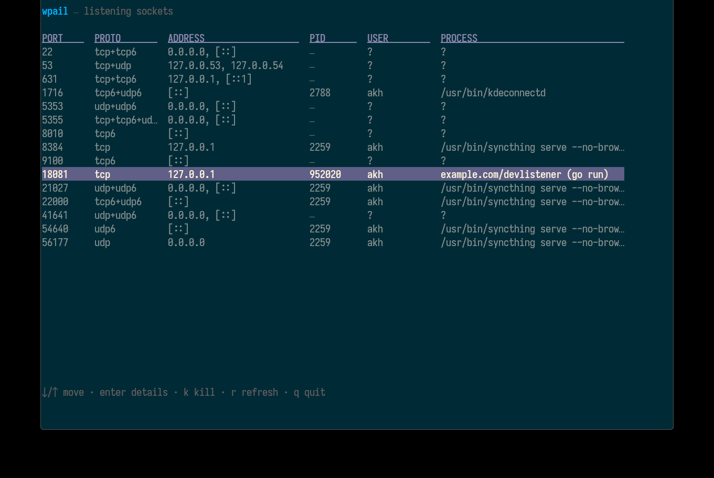
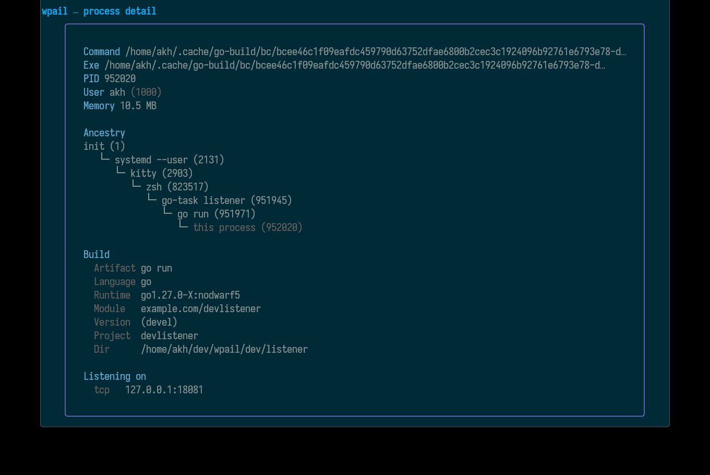

# wpail

**wpail** answers the question *what port/application is listening?* — like `lsof -i :PORT` or `ss -ltnp`, but purpose-built, fast, and with an interactive UI.





It is built for developers: instead of a bare PID or a cryptic temp path, wpail identifies **your application** — a listener started with `go run .` shows up under its project name (e.g. `github.com/akhenakh/listener (go run)`), with toolchain, project directory and VCS state one keypress away.

It reads the kernel tables directly (no shelling out to other tools), so it stays self-contained. Supported platforms:

- **Linux** — reads procfs (`/proc/net/*`, `/proc/<pid>/fd`), builds without cgo.
- **macOS (Apple Silicon, arm64)** — walks process file descriptors through `libproc`; requires a C toolchain (the Xcode Command Line Tools, already present on any dev machine).

## Install

With [Homebrew](https://brew.sh) (macOS Apple Silicon and Linux):

```sh
brew install akhenakh/tap/wpail
```

## Usage

```sh
wpail              # interactive TUI over every listener (default with no args)
wpail -t 6666      # same TUI, filtered to one port
wpail 6666         # PIDs listening on TCP/UDP port 6666, one per line
wpail -u 6666      # PID + owning user
wpail -v 6666      # verbose: PID, user, build metadata per listener
```

Exit codes: `0` found, `1` nothing found / scan error, `2` usage error.

### What it matches

Both TCP and UDP sockets whose **local** port equals the argument — TCP only counts the LISTEN state; UDP has no listen state so any bound socket matches. IPv4 and IPv6 (`tcp6`, `udp6`) are included.

## Developer builds

Temp binaries from `go run .` or `cargo run` are identified instead of shown
as cryptic temp paths. The list view labels them with the **full module
path** — `github.com/akhenakh/listener (go run)` — falling back to the short
project name when the path would be too long. The process detail view has a
**Build** block with module path, toolchain, project directory and VCS
state, and `wpail -v PORT` prints the same per PID:

```
PID     USER  BUILD     PROJECT   RUNTIME              VCS         DIR
417913  akh   go run    listener  go1.27.0             main b784*  /home/akh/dev/listener
417940  akh   cargo     listener  rustc 1.95.0 (5980…  -           /home/akh/dev/listener
```

Everything is agentless, read straight from the binaries:

- **Go** — the embedded buildinfo blob (`debug/buildinfo`): main module
  path, Go version, VCS revision/branch and dirty flag. Survives `-s -w`
  and stays readable after `go run` unlinks the temp binary, since wpail
  opens the live `/proc/<pid>/exe` inode.
- **Rust** — the ELF `.comment` section (`rustc version …`, survives
  `strip --strip-all`), `target/{debug,release}` path conventions and
  `Cargo.toml` for the project name.
- **Zig** — `.comment` (`zig X.Y.Z`, debug builds only), `zig-out/bin`
  and the `zig run` cache paths.

## Interactive mode

`wpail -t` shows a live table of listeners: port, protocols, local address(es), PID(s), process and user.

| Key | Action |
|---|---|
| `↓/↑`, `j`, `g/G` | move selection |
| `enter` or `i` | process detail: command line, exe path, owner, RSS memory, all bound ports, plus a **Build** block (module, toolchain, project dir, VCS) for developer builds |
| `k` | send a signal — a dialog opens to pick SIGTERM, SIGKILL, SIGINT, SIGHUP, SIGQUIT or SIGSTOP |
| `r` | refresh now (the list also auto-refreshes every 2 s) |
| `q` / `ctrl+c` | quit |

Killing is permission-checked up front: if you are not the owner of the target process (and not root), wpail explains that instead of dying on `EPERM`. Sockets vanish from the table right after a successful signal.

Without root, wpail can only resolve owners of sockets owned by your user — unidentified rows appear as pid `—`; rerun with `sudo` for the full system view.

## Building

Requires Go 1.27+ (and on macOS, the Xcode Command Line Tools for cgo).

```sh
task build       # binary in bin/wpail (static on Linux, links libSystem on macOS)
task check       # vet + go fix + tests + build
task test        # unit tests only
task listener    # launch the dev listener fixture app (`go run .`, port 18081),
                 # then inspect it: task run -- -v 18081
```

Or without task:

```sh
# Linux — no cgo needed:
CGO_ENABLED=0 go build -trimpath -ldflags "-s -w" -o bin/wpail .
go install github.com/akhenakh/wpail@latest   # once published
```

On macOS keep cgo enabled (it is by default); `CGO_ENABLED=0` breaks the libproc backend there.

## How it works

- **Linux:**
  1. Parse `/proc/net/{tcp,tcp6,udp,udp6}` for listening sockets (kernel prints addresses as little-endian hex words).
  2. Walk `/proc/<pid>/fd/*` symlinks of the form `socket:[inode]` to map each socket inode to owning PIDs.
  3. Enrich PIDs from `/proc/<pid>`: uid → username via NSS, cmdline/comm, exe link, VmRSS memory.
- **macOS (arm64):**
  1. Enumerate all processes with `proc_listallpids`, list each one's file descriptors with `proc_pidinfo(PROC_PIDLISTFDS)`.
  2. Resolve socket descriptors via `proc_pidfdinfo(PROC_PIDFDSOCKETINFO)`; keep TCP sockets in listen state and bound UDP sockets.
  3. Enrich PIDs from `PROC_PIDTBSDINFO`/`PROC_PIDTASKINFO` and the `kern.procargs2` sysctl.

## Layout

```
main.go           CLI parsing, output rendering, signal delivery
listen/           platform-neutral snapshot API + per-OS scanners (procfs / libproc)
bininfo/          agentless build metadata from process binaries (go/rust/zig)
dev/listener/     standalone fixture app (`task listener`) for trying wpail out
tui/              Bubble Tea v2 model/view/update, lipgloss styling
```

## Limitations

- macOS support is arm64-only by design (`darwin && arm64` build tags).
- The list refreshes at a fixed cadence rather than reacting to socket events.
- `-u` prints processes known to your current privileges; run as root (or with `sudo`) when auditing services.
